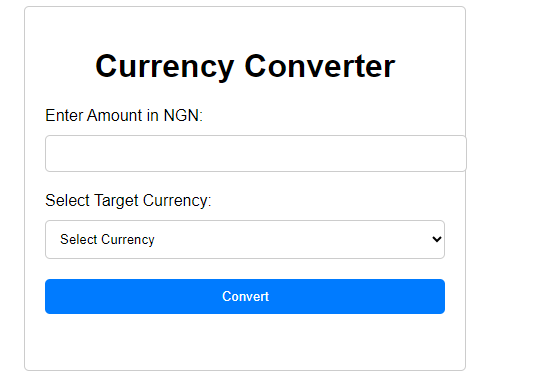
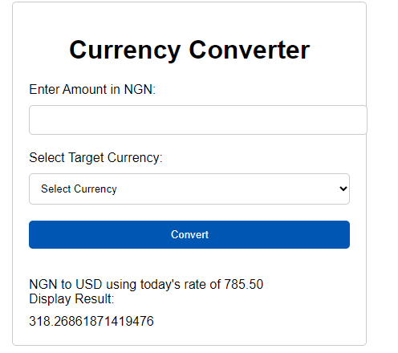

A web application that allows users to convert Nigerian Naira
(NGN) to United States Dollar (USD), Euro (EUR), and British Pound (GBP) using Python Flask.
The application should provide a dropdown menu for users to select the target currency and
input an amount in NGN to convert.
Requirements
1. Use Python Flask as the web framework for your application.
2. Create a simple HTML form with a dropdown menu that allows users to select the target
currency (USD, EUR, or GBP).
3. Implement a route and a function to handle the conversion logic based on the selected
currency.
4. Use predefined exchange rates for the conversion
5. Display the converted amount in the selected currency on the web page.
6. Style the user interface with CSS to make it visually appealing.
7. Include clear instructions for users on how to use the converter.

How to install

1. install the python flask dependencies
    command:  pip install -r requirements.txt
2. run the flask app
    command: flask run
3.  launch your web browser and run url: http://127.0.0.1:5000

    

4.  input your amount and click on currency type United States Dollar (USD), Euro (EUR), and British Pound (GBP).

    

